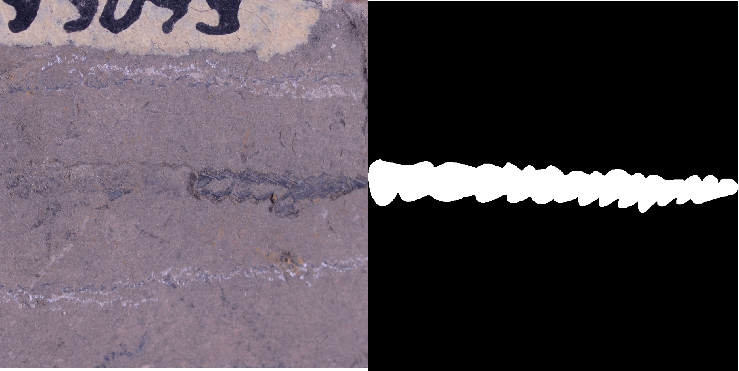
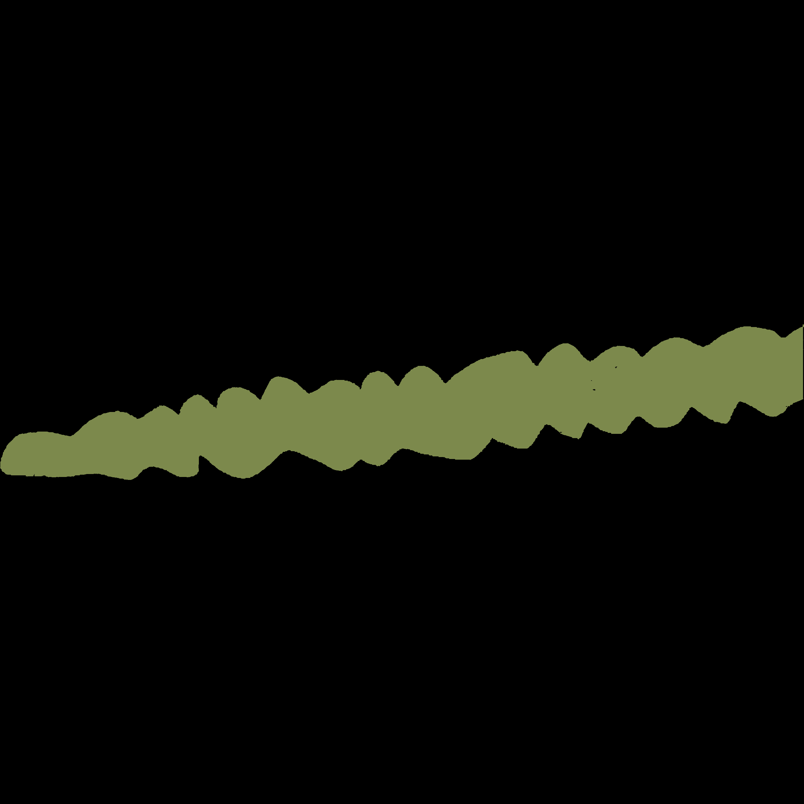

English | [简体中文](README_CN.md)

<div align="center">

<p align="center">
  
</p>


**A High-Efficient Research Development Toolkit for Image Segmentation Based on Pytorch.**

[](LICENSE)


</div>

## News 

<ul class="nobull">
  <li>[2023-03-29] : fire: SegAll v0.1 is released! Check more details the following
  <li>[2023-04-03] : fixed some transforms bug,and add U2Net, data prepare for optic_disc(MICCAI2021)。
 
</ul>

## Introduction

SegAll is an end-to-end high-efficent research development toolkit for image segmentation based on Pytorch, which  helps both developers and researchers in the whole process of designing segmentation models, training models, optimizing performance and inference speed, and deploying models. A lot of well-trained models and various real-world applications in both industry and academia help users conveniently build hands-on experiences in image segmentation.

**Note: This Toolkit many codes based on or inspired by [PaddleSeg](https://github.com/PaddlePaddle/PaddleSeg) Toolkit.Thanks to their wonderful and elegant work!**

The supported domains are the following:
<ul class="nobull">
  <li>RGB Segmentation
  <li>RGBD Segmentation
  
</ul>


## Overview to SegAll

<table align="center">
  <tbody>
    <tr align="center" valign="bottom">
      <td>
        <b>Models</b>
      </td>
      <td colspan="2">
        <b>Components</b>
      </td>
    </tr>
    <tr valign="top">
      <td>
        <ul>
        <details><summary><b>RGB Segmentation</b></summary>
          <ul>
          <li>
              <a  href="./doc/models/DeepLabV3p/README.md">DeepLabV3</a>
            </li>
            <li>
              <a  href="./doc/models/U2Net/README.md">U2Net</a>
            </li>
          </ul>
        </details>
        <details><summary><b>RGBD Segmentation</b></summary>
          <ul>
            <li>ESANet</li>
          </ul>
        </details>
      </td>
      <td>
        <details><summary><b>Backbones</b></summary>
          <ul>
            <li><a href="./doc/models/backbone/ResNet/README.md">ResNet</a></li>
          </ul>
        </details>
        <details><summary><b>Losses</b></summary>
          <ul>
            <li><a href="./segall/models/losses/cross_entropy_loss.py">Cross Entropy Loss</a></li>
          </ul>
        </details>
        <details><summary><b>Metrics</b></summary>
          <ul>
            <li>mIoU</li>
            <li>Accuracy</li>
            <li>Kappa</li>
            <li>Dice</li>
            <li>AUC_ROC</li>
          </ul>  
        </details>
      </td>
      <td>
        <details><summary><b>Datasets</b></summary>
          <details><summary><b>RGB Datasets</b></summary>
          <ul>
            <li><a href="./paddleseg/datasets/optic_disc_seg.py">OPTIC DISC SEG</a></li>
          </ul>
          </details>
          <details><summary><b>RGBD Datasets</b></summary>
          <ul>
            <li><a href="./paddleseg/datasets/ade.py">SUNRGBD</a></li>
            <li><a href="./paddleseg/datasets/ade.py">NYUV2</a></li>  
          </ul>
          </details>
        </details>
        <details><summary><b>Data Augmentation</b></summary>
          <details><summary><b>RGB Data Augmentation</b></summary>
            <ul>
            <li>Flipping</li>  
            <li>Resize</li>  
            <li>ResizeByLong</li>
            <li>ResizeByShort</li>
            <li>LimitLong</li>  
            <li>ResizeRangeScaling</li>  
            <li>ResizeStepScaling</li>
            <li>Normalize</li>
            <li>Padding</li>
            <li>PaddingByAspectRatio</li>
            <li>RandomPaddingCrop</li>  
            <li>RandomCenterCrop</li>
            <li>ScalePadding</li>
            <li>RandomNoise</li>  
            <li>RandomBlur</li>  
            <li>RandomRotation</li>  
            <li>RandomScaleAspect</li>  
            <li>RandomDistort</li>  
            <li>RandomAffine</li>  
          </ul>
          </details>
            <details><summary><b>RGB Data Augmentation</b></summary>
          </details>
        </ul>
      </td>
      <td>
</td>
    </tr>
  </tbody>
</table>

<details open>
<summary>Supported backbones and swallow dates whole </summary>

- [x] [ResNet](./doc/models/backbone/ResNet/README.md)
</details>

<details open>
<summary>Supported architecture and swallow dates whole </summary>

- [x] [DeepLabv3p](./doc/models/DeepLabV3p/README.md)
- [x] [U2Net](./doc/models/U2Net/README.md)
</details>


## Data PrePare
You Can Choose the following benckmark:(Please Click them to read how to prepare it)
<details open>
<summary>Supported download benckmark from website </summary>

- [x] [MICCAI2021 DISC SEG](Benckmark_data_prepare/RGB/MICCAI2021/README.md)
- [x] RGBD- SUNRGB-D
- [x] RGBD- NYUv2
- [x] CitySpace


</details>


## PyTorch Version on this 
You Need to confirm the version of pytorch must >=1.6.0

## run training , validate , predict args

In train.py
```bash

        "--config" , [Required] must give yml

        '--iters', [Not Required] 

        '--batch_size', [Not Required]

        '--learning_rate', [Not Required]

        '--resume_model', [Not Required]

        '--save_dir', [Not Required] 

        '--do_eval', [Not Required]  if you want to evaluate  --do_eval

        '--use_vdl', [Not Required]  if you want to viz --use_dl


        '--seed', [Not Required] 


        '--log_iters', [Not Required] 
        
        '--num_workers', [Not Required]
       

        '--opts', [Not Required]

        '--keep_checkpoint_max', [Not Required] default:5  how many iter result to save

        '--save_interval', [Not Required] default:1000
      

```
When you want to run train.py,example:
```bash
python train.py --config xxxx.yml --do_eval --use_vdl
```
It means that run the yml to train and do evaluate and logger in tensorboard

In val.py
```bash
python val.py --config xxx.yaml --model_path xxx/output/best_model/ckpt_iters_best_model.pth 
```

In predict.py
```bash
python predict.py  --config xxx.yaml --model_path /xxx/ckpt_iters_best_model.pth --image_path  /xxx/JPEGImages/P0193.jpg
```

## About Binary mask Dataset(num_classes=2):

if you want to train 2 binary mask,like this:


if you dont want to change your dataset pictures,please notice:

you need to  set 'binary_label_max_index' on  your yaml file. We recommand you set params about dataset on 'configs/_base_/your_dataset.yaml. 

As you see,when your dataset mask is 0 & 255,you need set 'binary_label_max_index' : 255

Examples:

```bash
train_dataset:
  type: Dataset
  dataset_root: xxxxxxxxxxx/data
  train_path: xxxxxxxxxx/train_list.txt
  separator: "\t"
  num_classes: 2 
  binary_label_max_index: 255  ##### binary mask max pixel value
  transforms:
    .......
    - type: Normalize
  mode: train

val_dataset:
  type: Dataset
  dataset_root: xxxxxxxxxxxxxxxxxx
  val_path: xxxxxxxxxx/valid_list.txt
  separator: "\t"
  num_classes: 2
  binary_label_max_index: 20
  transforms:
   。。。。
  mode: val

```
Another Example:
If your mask looks like this



you need to get the "green" pixel value. As I get it is 20.

So you can see the graptolite.yaml, I set 'binary_label_max_index' as 20


## TODO:
<li>Medical 3D Segmentation
<li>Text-Image Segentation
<li>Domain Adaptive
<li> Training 
  <li> use_ema model
  <li> resume model training


## Citation
author: BairdXiong,Graduated from [WuhanUniversity of Techonolgy](http://www.whut.edu.cn/) 2023 . Studying for a master's degree in electronic information at [SIAT](https://www.siat.ac.cn/)(Shenzhen Institute of Advanced Technology，Chinese Academy of Sciences) Now.

codes from: [PaddleSeg](https://github.com/PaddlePaddle/PaddleSeg) and transfrom it to Pytorch for doing resarch  and learning  on segmentation.

```bash
@misc{liu2021paddleseg,
      title={PaddleSeg: A High-Efficient Development Toolkit for Image Segmentation},
      author={Yi Liu and Lutao Chu and Guowei Chen and Zewu Wu and Zeyu Chen and Baohua Lai and Yuying Hao},
      year={2021},
      eprint={2101.06175},
      archivePrefix={arXiv},
      primaryClass={cs.CV}
}

@misc{paddleseg2019,
    title={PaddleSeg, End-to-end image segmentation kit based on PaddlePaddle},
    author={PaddlePaddle Contributors},
    howpublished = {\url{https://github.com/PaddlePaddle/PaddleSeg}},
    year={2019}
}
```

# Introduction to  MixLab
Our research group focus on intelligent computational methods and clinical application research on multi-modal tumor imaging such as computed tomography(CT), magnetic resonance imaging(MRI), Ultrasound(US), Endoscopy and Pathology. Since malignant tumor is a complex and heterogeneous disease, as well as the physical, chemical, and biological characteristics of different imaging technique, a single imaging method has its limitations in resolution, sensitivity, and contrast for tumor imaging. To leverage the information of cross-modality imaging, we develop learning-based computational methods to capture micro-level tumor characteristics by computing imaging and automatically segment tumor/OARs and extract information from radiology images and digital pathology for diagnosis, treatment planning, intraoperative navigation, and prognosis prediction.

The Qin Group focuses on cutting‐edge research in the interdisciplinary of computer science, medical physics, and biomedical science, developing and applying computational methods to biomedical optical imaging and multi-modality of medical data analysis for precision tumor diagnosis and therapy. The lab develops novel methods in computing optical imaging, image computing and analysis, computing visualization, and AI, including computing reconstruction, unsupervised generative network, multi-modal fusion, and multi-task learning, weak supervision, mixed reality, and decision theory to tackle the challenges of leveraging multi-modal medical data. Our exciting work is bridging the field of biomedical engineering domains with multidisciplinary collaborations with top scientists at the Chinese Academy of Sciences as well as with other institutions internationally.

We collaborate with a variety of investigators at the Chinese Academy of Sciences as well as with clinical investigators outside SIAT. Our ultimate goal is to bridge the gap between clinical knowledge and engineering--for all oncology knowledge and research data to be captured, structured, accessed, and processed by computers so that we can create and provide novel tools in image workstations for improving clinical effectiveness and efficiency.

The miX-Lab is in the Research Center for Medical Robotics and Minimally Invasive Surgical Devices of the Institute of Biomedical and Health Engineering at Shenzhen Institute of Advanced Technology, Chinese Academy of Sciences.

## Welcome like-minded students to join our laboratory !!! 
### Our Lab [Homepage](http://www.qin-mixlab.cn/)
