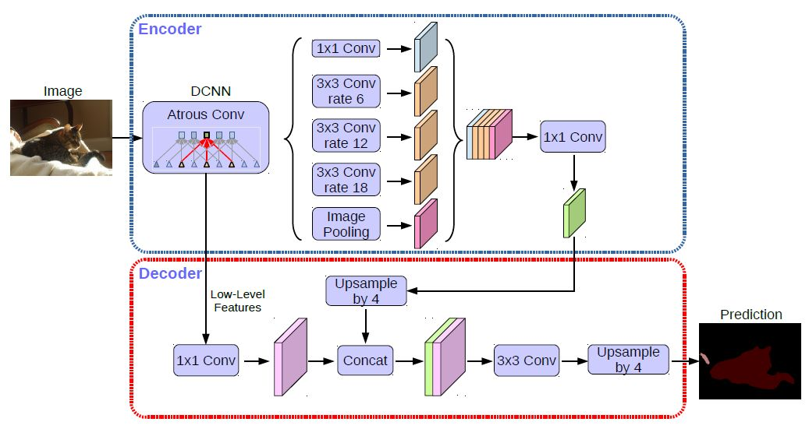

<div align="center">

[English](README.md)| 简体中文

</div>

# 论文速览

## 论文摘要
语义分割任务通常会用到**空间金字塔模块**和编解码模块。前者有利于提取多尺度上下文信息，后者更容易捕获边缘信息。本文结合了这两种方法的优势，deeplabv3+通过增加了简单并且高效的编码模块来改进分割结果。我们进一步发现了Xception，并且将深度可分离卷积作用到金字塔模块和编码模块来获得更快更强的网络。

## 模型结构
<div align="center">
  
</div>

### 编码部分
在编码部分，分别从backbone中抽取两个特征层出来，backbone可以是Xception也可以是mobilenet系列，重点在于深层的特征提取出来后，通过空洞卷积生成5个特征层，然后cancat到一起，再通过1*1卷积融合通道特征。这里空洞卷积系数分别是6，12，18

### 解码部分
深层特征四倍上采样后与浅层特征cancat，之后再四倍上采样恢复原图尺寸，得到的就是预测结果。loss部分可以是交叉熵损失也可以是dice loss


## 主要贡献
<ui>1）提出了一种新的编解码结构</ui>
<ui>2）通过atrous 卷积来控制分辨率，从而权衡精度和时间</ui>
<ui>3）采用Xception模型来处理分割任务并且在ASPP 模块和编码模块加入深度可分离卷积，从而获得更快更强的网络</ui>

##

# 如何在自己的数据集上训练

## 数据准备

首先你需要将数据集整理成如下形式，需要将图像按照自己的需要划分训练集以及验证集，并存储到train_list.txt val_list.txt中
```bash
.
├── SegAll
├── data
|   ├── Images
|   |   ├── xxx.jpg 
|   |   ├── xxx.jpg
|   ├── Mask
|   |   ├── xxx.png
|   |   ├── xxx.png
├── |── train_list.txt
├── |── val_list.txt
├── |── label_list.txt
```
此时你需要注意的是：img和mask的间隔符号，例如：
```bash
img_train/T008757.jpg lab_train/T008757.png # 此时的分割符号为 " "
img_train/T008757.jpg\tlab_train/T008757.png # 此时的分割符号为 "\t"
```
在配置dataset的设置文件中，默认的方式以" "间隔，如以\t或其他方式，请以此方式注明：

```bash
train_dataset:
  type: Dataset
  dataset_root: ...
  train_path: ....
  separator: "\t"  # 例 以\t为分割符
  .......
  mode: train

val_dataset:
  type: Dataset
  dataset_root: ...
  val_path: .
  separator: "\t"  # 例 以\t为分割符
  ......
  mode: val
```


## 配置文件

```bash

_base_: "../_base_/graptolite.yaml"  # 集成的上层yml文件


model:
  type: Deeplabv3p
  backbone:
    type: ResNet34_vd
    output_stride: 8
    # TODO : pretrained: torchpretrained
  num_classes: 4   # 注意与dataset的配置num_classes
  backbone_indices: [0,3]
  aspp_ratios: [1,12,24,36]
  align_corners: False
  pretrained: null

optimizer:
  type: SGD
  lr: 1.e-4
  momentum: 0.9
  weight_decay: 4.0e-5

lr_scheduler:
  type: OneCycleLR
  total_steps : 10000
```


## 训练
```bash
python train.py  --config configs/RGB/deeplabv3p.yaml --do_eval --use_vdl
```

## 验证
```bash
python val.py --config configs/RGB/deeplabv3p.yaml  --model_path ckpt_epoch_best_model.pth --image_path Image/test.png 
```

## 预测

```bash
python predict.py --config configs/RGB/deeplabv3p.yaml \
                 --model_path ckpt_epoch_best_model.pth \
                 --image_path Image/test.png 
```