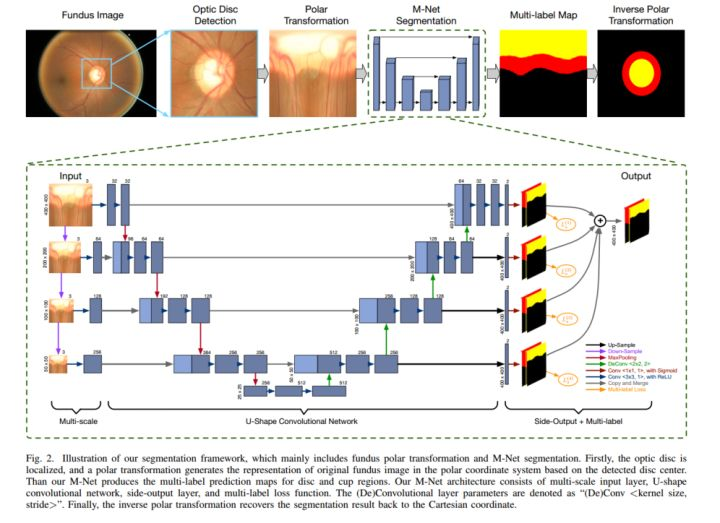

# Joint Optic Disc and Cup Segmentation Based onMulti-label Deep Network and Polar Transformation 

## 1. Abstract
提出了一种网络结构，M-Net（one-stage multilabel system），用来 一次性进行视杯视盘的分割。M-Net主要组成多尺度的输入层形成不同层次的感受野U形卷积层
学习多层次特征side-output layer
为不同的比例层生成伴随局部预测图。multi-label loss function 为了进一步提升分割表现，我们使用了极坐标转换

## 2. Introduction

            青光眼是不可逆的，筛查很有必要。人工筛查很耗时，所以自动筛查方法很有必要。通过杯盘比来筛查是一种常用的手段，所以，视杯视盘的准确分割就很有必要。之前也有人用OCT来做，但设备贵，也有分别提取，然后人工来计算关系。在论文中，我们把视杯视盘分割作为多label的任务，主要贡献包括：
                M-Net基于dice-loss的多label loss函数运用了极坐标转换来提升分割表现在数据集上进行了分割实验，并使用分割结果进行了青光眼筛查实验

## 3. Methed

· 先用现有的方法定位视盘，然后把原图转换为极坐标，作为标签输入网络，之后再恢复。

· 关于网络结构，几个细节

· Multi-scale Input Layer:

· 将图片resize成不同尺寸的400,200,100,50。其中400的输入U-Net网络，200,100,50,依次经过average pooling

· #疑问 这个相当于旁路，是通过卷积之后输入网络的吗，卷积的这一步是否参与学习，如果参与，那学习的时候是怎么进行的；如果不参与，卷积核的参数又是如何确定的？

解答：应该是可以直接训练的，暂时还没实验，这应该是多路径的训练问题，原代码是用Keras写的，没有显示前向后项传播的路径。