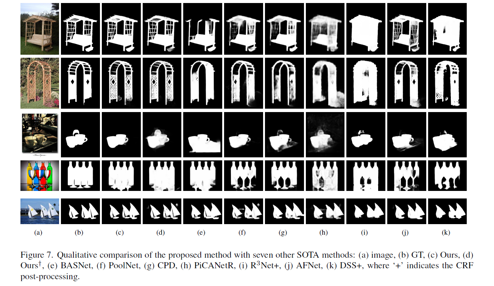
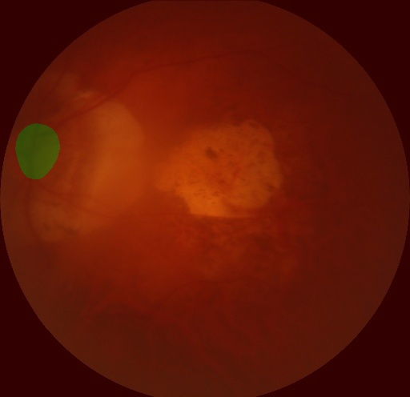

# U2Net

##  论文速览

U2-net是阿尔伯塔大学（University of Alberta）在2020年发表在CVPR上的一篇文章。该文章中提出的U2-net是针对Salient ObjectDetetion(SOD)即显著性目标检测任务提出的。而显著性目标检测任务与语义分割任务非常相似，只不过显著性目标检测任务是二分类任务，它的任务是将图片中最吸引人的目标或区域分割出来，故只有前景和背景两类。



## 摘要


## 创新点


## 模型架构

以下就是u2net的网络结构，总体还是unet的u形结构，但是其中的每层或者每个stage由unet中朴素的卷积结构变为了RUS（Residual U-blocks），然后每个decoder的侧边输出都收到gt的监督，所有的侧边输出做concat之后，在进行卷积操作就是最终的网络输出了。
之前的研究还有堆叠或者级联unet得到 u ∗ n − n e t u*n-net u∗n−net，但是作者是嵌套或者指数表示unuet去了，显然嵌套的数量可以很大，即 u n n e t u^n net unnet，但是考虑实际情况，还是嵌套一层得到 u 2 n e t u^2 net u2net
然后每个RSU的层数随着encoder的层数的增加而减少，即En_1、En_2、En_3、En_4使用的分别是RSU-7、RSU-6、RSU-5、RSU-4,因为我们重视对于高分辨率特征图的特征提取，同时会进行池化操作，降低尺寸。而En_5、En_6采用的就是RSU-4F了，F表示不会变化尺寸，也就是只进行特征提取。

在Encoder阶段，每通过一个block后都会通过最大池化层下采样2倍，在Decoder阶段，通过每一个block前都会用双线性插值进行上采样

## 如何训练(以OPTIC SEG数据集为例)

### 数据准备

```bash
bash Benckmark_data_prepare/RGB/MICCAI2021/disc_cpu.sh
```
下载的数据集自动划分了 train_list.txt val_list.txt 因此可以直接训练

### 模型训练

```bash
python train.py --config configs/RGB/U2Net/u2net.yaml  --save_interval 200 --do_eval

```

```bash
76/76 [==============================] - 7s 86ms/step - batch_cost: 0.0862 - reader cost: 0.0086
2023-04-03 07:47:12 [INFO]      [EVAL] #Images: 76 mIoU: 0.9024 Acc: 0.9962 Kappa: 0.8923 Dice: 0.9461
2023-04-03 07:47:12 [INFO]      [EVAL] Class IoU: 
[0.9961 0.8087]
2023-04-03 07:47:12 [INFO]      [EVAL] Class Precision: 
[0.9977 0.9118]
2023-04-03 07:47:12 [INFO]      [EVAL] Class Recall: 
[0.9984 0.8773]
./output/iter_1800/ckpt_iters_1800.pth has been successfully saved
./output/best_model/ckpt_iters_best_model.pth has been successfully saved
2023-04-03 07:47:14 [INFO]      [EVAL] The model with the best validation mIoU (0.9024) was saved at iter 1800.

```

### 模型验证
```bash
python val.py --config configs/RGB/U2Net/u2net.yaml --model_path ./output/best_model/ckpt_iters_best_model.pth
```
得到以下结果

```bash
76/76 [==============================] - 40s 532ms/step - batch_cost: 0.5316 - reader cost: 0.0091
2023-04-03 10:41:06 [INFO]      [EVAL] #Images: 76 mIoU: 0.9024 Acc: 0.9962 Kappa: 0.8923 Dice: 0.9461
2023-04-03 10:41:06 [INFO]      [EVAL] Class IoU: 
[0.9961 0.8087]
2023-04-03 10:41:06 [INFO]      [EVAL] Class Precision: 
[0.9977 0.9118]
2023-04-03 10:41:06 [INFO]      [EVAL] Class Recall: 
[0.9984 0.8773]
```

### 预测

```bash
python predict.py  --config configs/RGB/U2Net/u2net.yaml --model_path ./output/best_model/ckpt_iters_best_model.pth --image_path ./data/optic_disc_seg/JPEGImages/P0193.jpg
```

<div>added_prediction result:</div>



<div>pseudo_color_prediction result:</div>

